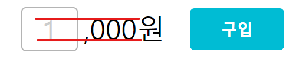

## 어떤 문제가 발생했는가

어떤 방법의 가운데 정렬 방법을 써도 한 줄에 들어간 두 가지 태그의 텍스트가 정렬이 안된다. 아래처럼 환경에 따라서도 차이가 심했다.

> 내 환경 예시

> 리뷰어님 환경 예시

## 문제의 원인

가운데를 정렬하는 스타일 적용에서 무언가 누락된 부분이 있을까 생각해서 vertical-align, line-height 등을 만져봤는데 제목이 스포한 것처럼 문제의 원인은 예상 외로 폰트에 있었다.

프로젝트에 크게 필요하다고 느끼지 못해서 전체 폰트 설정은 해주지 않았다. 그래도 기본적으로는 하나의 글꼴이 들어갈 것이라고 생각했다. 

근데 예상 외로 `<input>`에는 내 환경 기준 글꼴 arial이, 단위를 표시한 ‘,000원’ ``태그에는 맑은 고딕으로 설정되어있었다. 

생각해보니 한글이 포함되지 않은 `<input>`에는 영어 폰트 중 기본 값으로 설정된 것이, 한글 ‘원’이 포함된 ``에는 맑은 고딕이 자동으로 설정된 것이다. 그래서 리뷰어님의 환경에서는 또 그 환경 나름대로의 기본 값이 들어가 더 큰 차이가 보였던 것이다. 

## 해결책

전체에 적용할 기본적인 글꼴을 추가하고 나니 아래와 같이 그 차이가 확 줄어 사실 상 정렬할 수 있었다.

‘사실 상’이라고 표현한 것은 육안으로는 쉽게 파악하기 어렵지만 세밀하게 비교선을 그어보면 아직도 미세한 차이가 존재하기 때문이다. 이 부분은 아마도 `<input>`의 border 등의 다른 요소 때문이라고 생각된다. 텍스트 정렬을 완벽 마스터 할 때까지 앞으로도 계속 연구해야겠다...

---

참고자료: ****[(번역) CSS에 대한 깊은 이해: 폰트 매트릭스, line-height와 vertical-align](https://wit.nts-corp.com/2017/09/25/4903)****